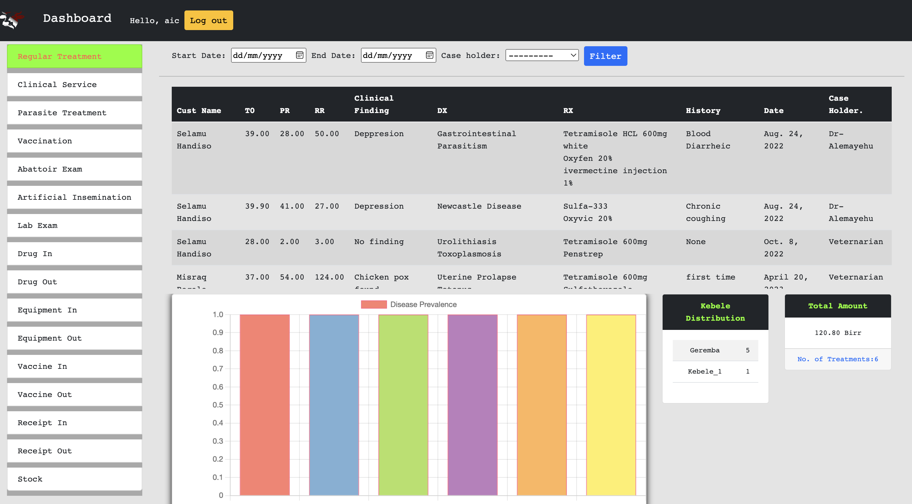
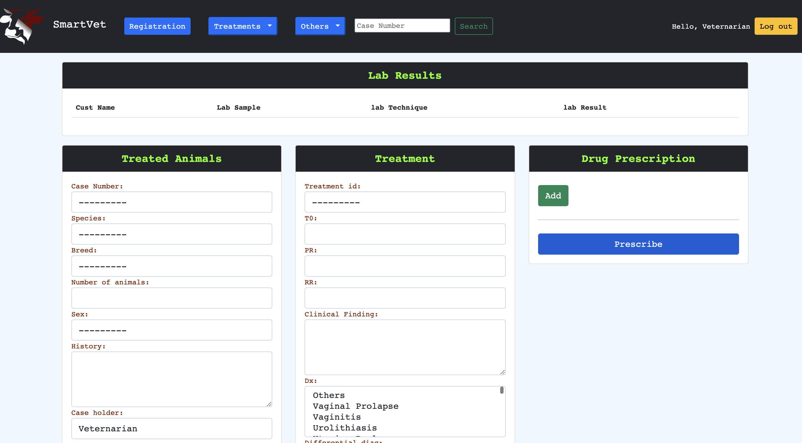
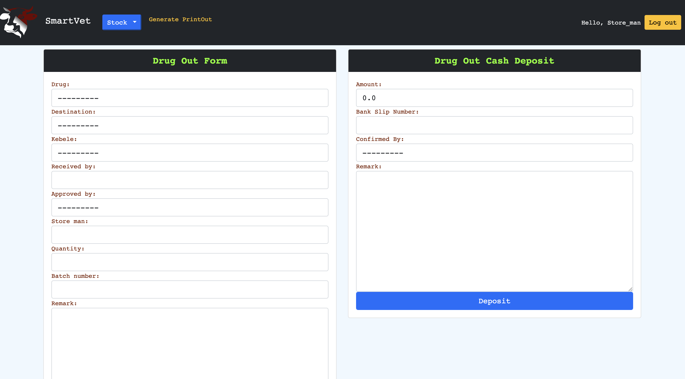

# Veternary Database Management System 

Re-writing our Veternary Database Management System that was written in core **PHP** into **Python (Django)**
***
>Initial Commit on `March 27, 2021`
***
## Features
- Dashboard 
- Animal Treatment. 
- Stock Management. 
- Laboratory Service.
- Drug Dispencary and Payment.
- Drug prescription,OPD and Vaccination.
  
